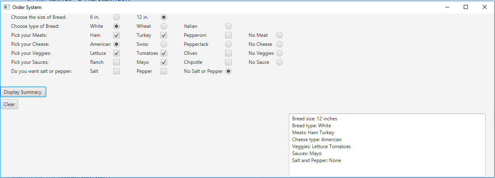

# SubwayGroupProject 

This project displays a GUI example of a subway ordering system allowing the user
    to pick various items for a sandwich.

## Example Output

## Analysis Steps

The problem asked for the creation of a mock subway ordering system. The user was to
    select a bread size, bread type, meats, cheese, veggies, sauce, and salt and pepper.
    A summary was to be displayed once a button was clicked. 

### Design

We first started by creating the labels, check boxes, radio buttons, buttons, and 
    text area on the form. Once the layout was complete, we then proceeded to had all
    of the event handlers for the two buttons. We then made event handlers for the
    "none" radio buttons. 

### Testing

We first tested the visual of the form. We then made sure that the buttons were working
    correctly and that the text area was displaying the correct output. We then made
    sure the clear button was working correctly. Then we tested the none radio buttons were
    clearing previous selected check boxes or radio buttons of the same type. 

## Notes

Explain any issues or testing instructions.

## Do not change content below this line
## Adapted from a README Built With

* [Dropwizard](http://www.dropwizard.io/1.0.2/docs/) - The web framework used
* [Maven](https://maven.apache.org/) - Dependency Management
* [ROME](https://rometools.github.io/rome/) - Used to generate RSS Feeds

## Contributing

Please read [CONTRIBUTING.md](https://gist.github.com/PurpleBooth/b24679402957c63ec426) for details on our code of conduct, and the process for submitting pull requests to us.

## Versioning

We use [SemVer](http://semver.org/) for versioning. For the versions available, see the [tags on this repository](https://github.com/your/project/tags). 

## Authors

Chase Dickerson and Austyn Gougey

See also the list of [contributors](https://github.com/your/project/contributors) who participated in this project.

## License

This project is licensed under the MIT License - see the [LICENSE.md](LICENSE.md) file for details

## Acknowledgments

Used Y. Daniel Liang's Intro to Java Programming 10th Edition. 
